# fast-volume-syncer

`fast-volume-syncer`는 여러 스토리지 경로 사이의 파일 트리를 빠르고 일관되게 복사·동기화하기 위한 Go CLI입니다. 단일 경로 복사부터 NFS 마운트 기반 동기화, CSV로 정의한 대량 작업 선택, 데몬 실행까지 하나의 실행 파일에서 다룹니다.

이 프로젝트의 핵심 의도는 **복사 대상 목록을 사람이 매번 수동으로 실행하지 않아도, CSV와 노드 선택자를 기준으로 안전하게 분산 실행하고 필요하면 샌드박스 안에서 스토리지를 마운트해 동기화하는 것**입니다.

## 한눈에 보는 프로젝트 의도



이 다이어그램은 운영 과제와 해결 방향을 설명합니다. CLI 명령이 내부 entry adapter와 runner로 연결되는 런타임 구조는 [`docs/diagrams/runtime-flow.svg`](docs/diagrams/runtime-flow.svg)에서 확인하세요. 원본 Mermaid와 2x PNG 산출물은 [`docs/diagrams/project-intent-flow.mmd`](docs/diagrams/project-intent-flow.mmd), [`docs/diagrams/project-intent-flow.png`](docs/diagrams/project-intent-flow.png)로 관리합니다.

## 프로젝트 구성과 실행 흐름


이 다이어그램은 CLI 표면, `internal/entry` adapter, 핵심 runtime package, build-tagged system helper, 검증 경계를 한 화면에 연결합니다. 원본 Mermaid와 2x PNG 산출물은 [`docs/diagrams/project-architecture-overview.mmd`](docs/diagrams/project-architecture-overview.mmd), [`docs/diagrams/project-architecture-overview.png`](docs/diagrams/project-architecture-overview.png)로 관리합니다. 더 세부적인 설정 전달, copier 실행, selector CSV, sync sandbox 흐름은 [`docs/diagrams/README.md`](docs/diagrams/README.md)의 task-specific diagrams를 참고하세요.

## 명령

```text
fast-volume-syncer copy SRC_PATH DST_PATH
fast-volume-syncer sync SRC_PATH [SRC_SUBPATH] DST_PATH [DST_SUBPATH]
fast-volume-syncer select [NODE_SELECTOR]
fast-volume-syncer select _|NODE_SELECTOR COPY_INFO_CSV_PATH
fast-volume-syncer start [NODE_SELECTOR|_]
fast-volume-syncer start _|NODE_SELECTOR COPY_INFO_CSV_PATH
fast-volume-syncer stop
```

| 명령 | 역할 |
| --- | --- |
| `copy` | 이미 접근 가능한 소스 경로를 대상 경로로 직접 복사합니다. |
| `sync` | 소스/대상 스토리지를 준비하고 copier에 위임합니다. 직접 실행한 `sync`는 기본적으로 namespace 샌드박스가 아니며, selector/daemon이 띄운 Linux sync child에서 샌드박스가 적용됩니다. |
| `select` | CSV 작업 목록을 읽고 노드 선택자로 필터링한 뒤 제한된 동시성으로 `sync` 작업을 실행합니다. |
| `start` | `select` 모드를 백그라운드 데몬으로 실행하고 pid/log 파일을 관리합니다. |
| `stop` | pid 파일을 읽어 실행 중인 데몬에 `SIGTERM`을 보냅니다. |

기본 CSV 경로는 `data/09_copy_entries.csv`입니다. 노드 선택자 없이 사용자 CSV만 지정하려면 첫 번째 인자로 `_`를 함께 넘깁니다.

```bash
fast-volume-syncer select _ custom.csv
```

`start`에서는 인자 하나짜리 `_`도 허용되며, 기본 선택자와 기본 CSV를 사용한다는 뜻입니다.

## 주요 옵션

플래그는 Viper를 통해 환경 변수로도 설정할 수 있습니다. 환경 변수 이름은 대문자이며 `-`와 `.`는 `_`로 변환됩니다.

- `--worker-size`: selector 모드에서 동시에 실행할 `sync` 자식 프로세스 수.
- `--task-size`, `--chunk-size`: copier/rsync 실행의 병렬성과 배치 크기.
- `--rsync-enabled`, `--rsync-*`: 네이티브 복사 대신 rsync 기반 복사를 사용하고 세부 동작을 조정합니다.
- `--scan-find-path`: 파일 스캔에 사용할 `find` 바이너리 경로 또는 Go 구현 사용 설정.
- `--sandbox-disabled`: selector/daemon이 띄우는 Linux sync child의 네임스페이스 샌드박스 격리를 건너뜁니다. 직접 `sync` 실행에는 이 샌드박스 경로가 기본 적용되지 않습니다.
- `--src-storage-*`, `--dst-storage-*`: 소스/대상 스토리지의 마운트 호스트, 옵션, 마운트 이름.
- `--retry-*`: 실패 시 재시도 횟수, 지연, 최대 지연, 지터.
- `--log-file`, `--pid-file`: 데몬 모드에서 사용할 로그와 pid 파일 경로.

## 동작 방식

1. `copy`는 경로 두 개를 받아 copier를 바로 실행합니다. 대상 루트는 생성 후 private directory policy를 적용하고, symlink나 다른 사용자가 쓸 수 있는 경로 구성요소가 있으면 거부합니다.
2. `sync`는 소스/대상 스토리지 경로와 선택적 하위 경로를 받아 마운트 준비 후 copier에 위임합니다. selector/daemon이 띄운 Linux child에서는 `_SYNCER_INVOKED`와 `_SYNCER_SANDBOXED` 환경에 따라 namespace 샌드박스를 먼저 적용합니다.
3. `select`는 CSV 엔트리를 읽고, 필요한 경우 노드 선택자로 필터링한 뒤 `--worker-size` 한도 안에서 `sync` 자식 프로세스를 실행합니다.
4. `start`는 selector 실행을 데몬화하고 `stop`은 pid 파일 기반으로 종료 신호를 보냅니다.

Linux에서는 마운트와 selector-invoked child 샌드박스 기능을 사용할 수 있습니다. Linux가 아닌 환경에서는 빌드 태그로 보호된 시스템 호출을 사용하지 않으며, 지원되지 않는 기능은 제한됩니다.

## 문서

유지보수 문서는 [`docs/README.md`](docs/README.md)에서 시작하세요.

- [`docs/requirements.md`](docs/requirements.md): 지원 동작과 비목표.
- [`docs/design.md`](docs/design.md): copy/sync/select/start 흐름과 데이터 계약.
- [`docs/architecture.md`](docs/architecture.md): 패키지별 책임.
- [`docs/operations.md`](docs/operations.md): 운영과 로컬 검증 절차.
- [`docs/correctness-evidence.md`](docs/correctness-evidence.md): 검증 주장별 근거 계약과 보고 규칙.
- [`docs/nfs-sync-sandbox-evidence.md`](docs/nfs-sync-sandbox-evidence.md): privileged NFS/mount sync 샌드박스 수동 근거 수집 런북.
- [`docs/diagrams/README.md`](docs/diagrams/README.md): 프로젝트 구성, 런타임, 설정, copier, selector, syncer, daemon, validation, NFS evidence 다이어그램.

## 검증

검증 수준은 세 단계로 나눕니다.

1. **기본 회귀 검증**: 모든 변경에서 `go test ./...`와 문서/Pi 리소스 체크를 실행합니다.
2. **선택적 Linux+bwrap 통합 스모크**: `bwrap`를 쓸 수 있는 Linux에서만 [`docs/correctness-evidence.md`](docs/correctness-evidence.md)의 `go test -tags=integration -run TestBwrapCopyE2E -count=1 .`를 추가 실행합니다.
3. **privileged NFS/manual 근거 수집**: 실제 NFS 마운트와 샌드박스 경로를 주장하려면 privileged 대상 환경에서 [`docs/nfs-sync-sandbox-evidence.md`](docs/nfs-sync-sandbox-evidence.md) 런북과 템플릿으로 명령, 로그, `findmnt`, checksum, `readlink`, cleanup 결과를 남겨야 합니다.

문서와 Pi 리소스를 포함한 기본 검증입니다. `go test ./...`는 문서 guardrail을 통해 주석 점검과 tagged integration/NFS compile-only 점검도 함께 실행하므로, 해당 도구와 build-tagged 테스트 소스가 로컬에서 동작해야 합니다.

```bash
go test ./...
{ printf '%s\n' README.md AGENTS.md CLAUDE.md; find docs -maxdepth 2 -type f; } | sort
python3 - <<'PY'
import json, pathlib
json.load(open('.pi/settings.json'))
for p in list(pathlib.Path('.pi/agents').glob('*.md')) + list(pathlib.Path('.pi/skills').glob('*/SKILL.md')) + list(pathlib.Path('.pi/prompts').glob('*.md')):
    s = p.read_text()
    if not s.startswith('---\n') or '\n---\n' not in s[4:]:
        raise SystemExit(f'bad frontmatter: {p}')
print('ok')
PY
git diff --check
```

다이어그램을 수정했다면 [`docs/operations.md`](docs/operations.md)의 Mermaid SVG/2x PNG 렌더링 절차도 실행합니다.

코드를 수정했다면 명시적으로도 추가 실행해 실패 원인을 분리합니다.

```bash
gofmt -w .
scripts/check-go-comments.py
go test -tags=integration -run '^$' .
go test -tags='integration,nfs' -run '^$' .
go vet ./...
```
