# NFS Sync Sandbox Evidence Runbook

Use this runbook when claiming that the privileged `sync` sandbox path works with real NFS mounts. Unit tests and bwrap copy smoke tests are not sufficient evidence for this claim.



The diagram source is [`diagrams/nfs-sync-sandbox-evidence-flow.mmd`](diagrams/nfs-sync-sandbox-evidence-flow.mmd), with a 2x PNG artifact at [`diagrams/nfs-sync-sandbox-evidence-flow.png`](diagrams/nfs-sync-sandbox-evidence-flow.png).

## Scope

This runbook verifies the path that requires all of the following:

- Linux mount namespace support.
- Permission to run the sync child with mount capabilities, usually root or `CAP_SYS_ADMIN`.
- Reachable source and destination NFS exports.
- NFS client tooling available on the test host.

Do not run this against production exports. Use disposable test exports and test data.

## Required inputs

Record these values before running the test:

```text
Date/time:
Host/kernel:
fast-volume-syncer commit or diff reference:
Source NFS host:
Source NFS export path:
Destination NFS host:
Destination NFS export path:
Source test subpath:
Destination test subpath:
Source verify root (FVS_TEST_SRC_VERIFY_ROOT):
Destination verify root (FVS_TEST_DST_VERIFY_ROOT):
Operator:
```

## `FVS_TEST_*` inputs for the committed integration skeleton

When running `go test -tags='integration,nfs' -run TestNFSSyncSandboxE2E -count=1 .`, set and record these inputs so the committed skeleton and the manual evidence use the same disposable targets:

| Variable | Meaning |
| --- | --- |
| `FVS_TEST_SRC_NFS_HOST` | Source NFS server host or IP forwarded to `SRC_STORAGE_MOUNT_HOST` for the selector-launched child. |
| `FVS_TEST_SRC_NFS_EXPORT` | Source NFS export path written into the one-row selector CSV as `source_volume`. |
| `FVS_TEST_DST_NFS_HOST` | Destination NFS server host or IP forwarded to `DST_STORAGE_MOUNT_HOST` for the selector-launched child. |
| `FVS_TEST_DST_NFS_EXPORT` | Destination NFS export path written into the one-row selector CSV as `destination_volume`. |
| `FVS_TEST_SRC_SUBPATH` | Relative disposable source fixture subpath written into the selector CSV as `source_path`. |
| `FVS_TEST_DST_SUBPATH` | Relative disposable destination fixture subpath written into the selector CSV as `destination_path`. |
| `FVS_TEST_SRC_VERIFY_ROOT` | Existing local realpath root used to create and checksum the source fixture outside the sandbox. It must not be `/`, must not be a symlink, must be owned by the privileged test user, must not be group/world writable, and should point at a disposable test mount root. |
| `FVS_TEST_DST_VERIFY_ROOT` | Existing local realpath root used to clear, recreate, and verify the destination fixture outside the sandbox. It must not be `/`, must not be a symlink, must be owned by the privileged test user, must not be group/world writable, and should point at a disposable test mount root. |

The committed skeleton removes and recreates `FVS_TEST_SRC_VERIFY_ROOT/FVS_TEST_SRC_SUBPATH` and `FVS_TEST_DST_VERIFY_ROOT/FVS_TEST_DST_SUBPATH`. Keep the source and destination fixture roots private to the privileged operator, disposable, not group/world writable, and free of symlinked path components. Do not point the verify roots at directories writable by other users or shared automation accounts.

## Copy/paste evidence template

Use this inline template or copy [`evidence/nfs-sync-sandbox.example.md`](evidence/nfs-sync-sandbox.example.md) into your evidence report.

````md
# NFS Sync Sandbox Evidence

- Verdict: VERIFIED | UNVERIFIED
- Date/time:
- Host/kernel:
- Commit or diff reference:
- Operator:

## Target environment
- Source NFS host/export:
- Destination NFS host/export:
- Source test subpath:
- Destination test subpath:
- Source verify root (`FVS_TEST_SRC_VERIFY_ROOT`):
- Destination verify root (`FVS_TEST_DST_VERIFY_ROOT`):
- Privilege mode (root/CAP_SYS_ADMIN/etc.):
- CSV `source_volume_key`: dummy non-secret placeholder only
- Verify roots: private, disposable, owned by privileged test user, not group/world writable, no symlinked path components

## Command
```bash
<exact sudo env -i selector command with allowlisted mount environment and select 0 CSV path>
```

## Log
- Log path: `/path/to/log`
- Redactions applied (`source_volume_key`, credentials, tokens, unrelated secrets):
- Attached stdout/stderr excerpt or reference:

## Mount evidence
```text
<findmnt output for source mount>
<findmnt output for destination mount>
```

## Data verification
```bash
sha256sum <source-mounted-file>
sha256sum <destination-mounted-file>
readlink <source-mounted-link>
readlink <destination-mounted-link>
```

## Cleanup evidence
```text
<findmnt | grep fast-volume-syncer || true>
<findmnt | grep syncer- || true>
```

## Notes
- Missing evidence or failures:
````

## Fixture setup

1. Create a source fixture on the source NFS export:

   ```text
   <source export>/<source test subpath>/nested/file.txt
   <source export>/<source test subpath>/link.txt -> nested/file.txt
   ```

2. Ensure the destination test subpath is empty or disposable.
3. Record checksums and symlink target from the source fixture:

   ```bash
   sha256sum <mounted-source-fixture>/nested/file.txt
   readlink <mounted-source-fixture>/link.txt
   ```

## Command

Run the real selector-launched child path. Do not simulate it by setting `_SYNCER_INVOKED` or `_SYNCER_SANDBOXED` on a direct `sync` command; that skips the selector's `SysProcAttr` namespace setup and can remount paths in the host namespace. Build the binary first, then run `select` against a one-row disposable CSV so the selector starts the `sync` child with the required environment and Linux namespace attributes.

The disposable CSV's `source_volume_key` field must be a dummy non-secret `source_volume_key` placeholder because selector/report logs can capture it. Redact `source_volume_key`, credentials, tokens, and unrelated secrets from shared evidence or pasted log excerpts.

```bash
umask 077
workdir="$(mktemp -d "${TMPDIR:-/tmp}/fast-volume-syncer-nfs.XXXXXX")"
chmod 700 "$workdir"
go build -o "$workdir/fast-volume-syncer" .
cat >"$workdir/one-row.csv" <<'CSV'
node,source_volume,destination_volume,source_path,destination_path,source_project_id,source_project_name,used_size,used_size_human,volume_type,volume_size,volume_size_human,destination_project_name,volume_name,source_volume_key
0,<source-export-path>,<destination-export-path>,<source-test-subpath>,<destination-test-subpath>,1,nfs-source,0,0B,nfs,0,0B,nfs-destination,test-volume,dummy-non-secret-source-volume-key
CSV

sudo env -i \
  PATH='/usr/sbin:/usr/bin:/sbin:/bin' \
  SRC_STORAGE_MOUNT_HOST='<source-nfs-host>' \
  SRC_STORAGE_MOUNT_OPTION='ro,nodiratime,noatime,vers=3,rsize=524288,wsize=524288,hard,intr,nolock,proto=tcp,timeo=600,retrans=2,sec=sys' \
  SRC_STORAGE_MOUNT_NAME='src' \
  DST_STORAGE_MOUNT_HOST='<destination-nfs-host>' \
  DST_STORAGE_MOUNT_OPTION='rw,nodiratime,noatime,vers=3,rsize=524288,wsize=524288,hard,intr,nolock,proto=tcp,timeo=600,retrans=2,sec=sys' \
  DST_STORAGE_MOUNT_NAME='dst' \
  REPORT_ENABLED=true \
  SCAN_FIND_PATH='' \
  RETRY_ATTEMPTS=0 \
  "$workdir/fast-volume-syncer" select 0 "$workdir/one-row.csv" \
  2>&1 | tee "$workdir/nfs-sync-sandbox.log"
```

Use a private `0700` workspace for the binary, CSV, and log. The `mktemp -d` example above avoids predictable `/tmp` filenames; on shared hosts, create the workspace in a root-owned `0700` location if local users can race files before the `sudo` step. Use an allowlisted environment (`sudo env -i` or an equivalent `sudo --preserve-env=...` list). Do not use `sudo -E` or `go run` for privileged evidence collection because inherited credentials or build variables can affect the root process and leak into logs.

## Required evidence

Capture all of the following before claiming success:

- Full command line with only the allowlisted environment values needed for the run; do not record unrelated inherited variables or secrets.
- Confirmation that the disposable CSV used a dummy non-secret `source_volume_key` value.
- Full stdout/stderr log from the command.
- `findmnt` output for the source and destination mount points from the report log, or equivalent host evidence.
- Destination file checksum matching the source fixture:

  ```bash
  sha256sum <mounted-destination-fixture>/nested/file.txt
  ```

- Destination symlink target matching the source fixture:

  ```bash
  readlink <mounted-destination-fixture>/link.txt
  ```

- Cleanup evidence showing temporary mount paths are unmounted/removed, for example no stale `syncer-*` mount entries in:

  ```bash
  findmnt | grep fast-volume-syncer || true
  findmnt | grep syncer- || true
  ```

- Before sharing evidence outside the privileged operator set, redact `source_volume_key`, credentials, tokens, and unrelated secrets from command logs, report logs, and pasted CSV snippets.

## Failure triage

- `operation not permitted`: confirm root or `CAP_SYS_ADMIN`, mount namespace policy, and container/VM privilege settings.
- NFS mount timeout or permission denied: verify export ACLs, host firewall, NFS version/options, and client tooling.
- Destination checksum mismatch: preserve source/destination fixtures and command logs; do not rerun cleanup until evidence is collected.
- Stale mount or temp path: run controlled cleanup and record the cleanup commands.

## Reporting rule

If any required evidence is missing, report NFS/mount sandbox behavior as unverified. Do not infer it from `go test ./...`, bwrap copy smoke tests, or non-sandboxed sync runs.
